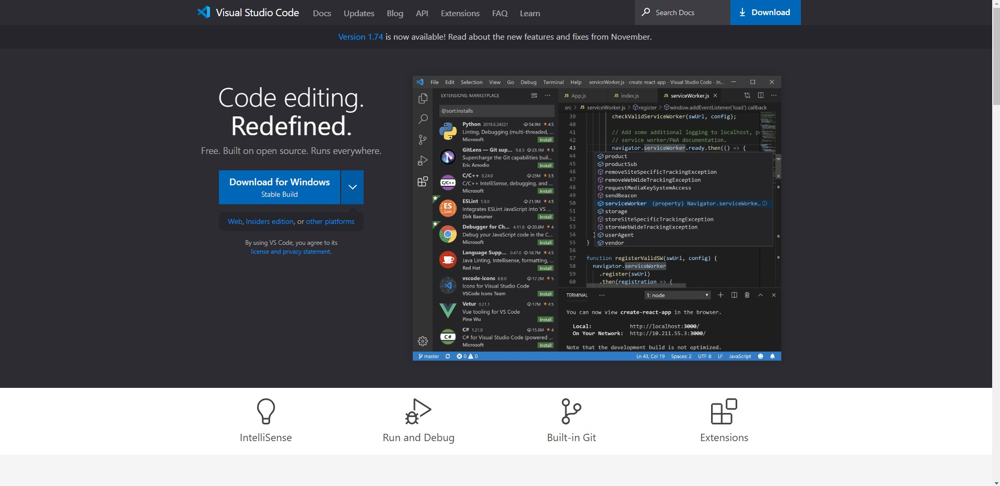

# Lab Tasks
  In this lab you will learn how to log into your course specific account through ieng6. This is divided into three simple steps, installing Visual Studio Code, remotely connecting, and finally, testing out some commands to make sure everything is functioning properly.
  
## Part 1 - Installing Visual Studio Code
The first thing you're going to want to do is head on over to the Visual Studio website which is [https://code.visualstudio.com/](https://code.visualstudio.com/) 

Once you're there, your screen should look like the picture below. 

After this, if you're on a computer running a Windows operating system, click the install button and you're good to go. If you're on any other OS such as Mac or Linux, click the drop down arrow next to the Windows Install button and options for your corresponding OS to install VScode should appear.

When the installation of VScode setup is done downloading, click on it and follow the setup instructions as prompted by the application to install the application. 
Once your installation is done, open VScode and it should look very similar to the picture below but with maybe a different color on the background.

And thats it, we're now done with installing VScode!

## Part 2 - Remotely Connecting
Before we begin with this step, were going to find the course specific account that you're trying to connect to. To get started with this step we're going to first head into [https://sdacs.ucsd.edu/~icc/index.php](https://sdacs.ucsd.edu/~icc/index.php) 

Once you're on this website, you're going to enter your username which should be the first part of your UCSD email. In the picture below we use the example email of johndoe@ucsd.edu. 
After entering your username, you'll have to enter your student ID number which begins with the letter A and is followed by a set of numbers, in the example below, John's student ID is A12345678.

Once you're signed in, you should be in a page similar to the one below in which John Doe's username is cse15lwi23doe .

Although you were not asked for any password, it's important that you know what it is as it will be used to log into your ieng6 account. In the event that you don't remember it, click the course specific account in which you're trying to log into and you will be brought into this page. 

Click the change your password button and follow the given instructions to successfully change your password.

After figuring out your corresponding username, you're going to click the Terminal option then new Terminal on VScode which should be along the top bar. Once the terminal is opened up, you want to go ahead and type the username for whatever you class may be followed by @ieng.ucsd.edu . For example John Doe would type cse15lwi23doe@ieng6.ucsd.edu in the terminal.Your terminal should look like the one below and you should be prompted with the same message.

Once you type yes into the terminal, you will then be prompted to type in your password. For privacy reasons your password will not be displayed as you're typing it into the terminal which is why its important that you remember it. 

After entering your password and hitting enter, you'll be brought into this below which means that you successfully signed in.

## Part 3 - Testing Commands
For the final step, we'll be typing some of the commands learned in CSE15L to verify that everything is working. Some commands you can run are cd, cd~, ls, ls -lat, etc..

For example, if you type ls -lat and everything is set up according to this tutorial, your terminal should print something very similar to what is printed in the picture below.

If everything is working well then you're done and you've succesfully logged into your course specific ieng6 account!

