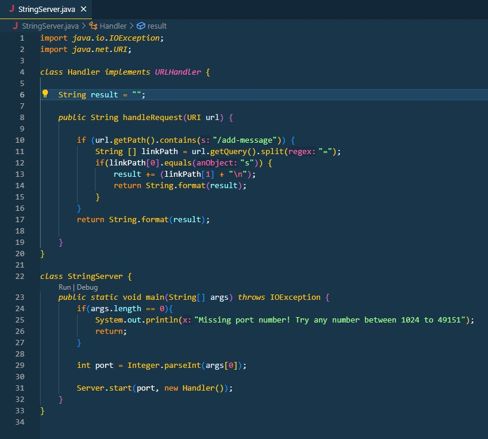

## Lab Report #2

# Part 1

Below attached is the picture for the code for StringServer.java and the two times running it in which I ran hello and testing.

For this first screenshot, The first method that is called is the handleRequest method which gets the URL. Another method that is called is the getPath method which is in turn used with .contains to check if the URL inputted by the user contains /add-message. After this, we call url.getQuery().split("=") to look for the = in the message which is used to differentiate what to print out on the website and what not to. 

The relevant arguments in this code would be the url argument in the handleRequest method which as previously mentioned, gets the URL. Other relevant arguments include the "=" in split and the "/add-message" in contains as the code would not function properly without them. 

The only values that change is what gets stored in the linkPath array and the reason they change is becasue the user might have different inputs, besides that everything stays the same. 

For this second screenshot, everything mentioned above for the first screenshot applies, the same methods run the same way. The only difference is that the messages after /add-message get added onto the same website as if it was a list.

# Part 2

For this part of the lab, I'll be using the bug from the reverseInPlace method in the ArrayExamples java class.

A failure inducing input for the buggy program in this case would,

<code> public void testReverseInPlace() {
        int[] input1 = {1,2,3};
        ArrayExamples.reverseInPlace(input1);
        for(int i = 0;i < input1.length;i++) {
          System.out.println(input1[i]);
        }
        assertArrayEquals(new int[]{3,2,1}, input1);
                                        </code>
 
 In this code, we expect to get {3,2,1} back in the array but instead we get {3,2,3}.
  
 An input that doesn't induce a failure in this buggy code would be if we were to put 
  
  <code> public void testReverseInPlace() {
        int[] input1 = {1,2,3};
        ArrayExamples.reverseInPlace(input1);
        for(int i = 0;i < input1.length;i++) {
          System.out.println(input1[i]);
        }
        assertArrayEquals(new int[]{3,2,3}, input1);
                                        </code>    
    
In this example above, we expect {3,2,3} and obtain {3,2,3}.
    
The symptom, being the wrong result in the code, can be seen in the screenshot below if we follow the code from the first example in which we expect {3,2,1} but obtain {3,2,3} as seen in the terminal at the bottom of the picture.

    
    
Another test for this can be seen if we run the code in the second example. In the screenshot below we expect {3,2,3} from the reverseInPlace method and we obtain {3,2,3} from inputting {1,2,3}.
    
    

# Part 3

Something I learned in these past two weeks was URL manipulation and how to use URL's in your code in java. It was also pretty interesting to learn how to start my own server and clone repositories from github onto my local pc and push them onto a server. 
