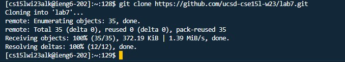
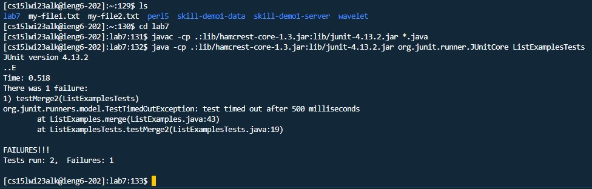
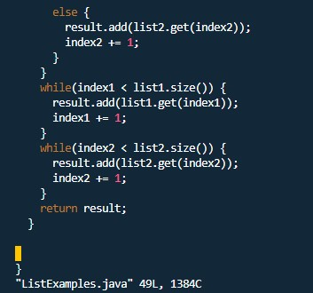
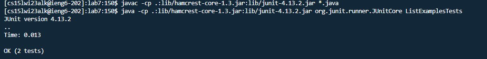
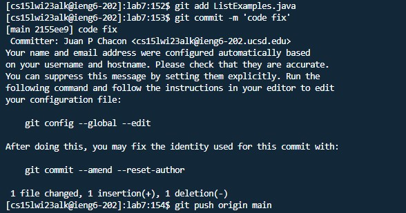

## Lab Report #4

For this lab report, we'll be recreating the steps that were done in our previous week 7 lab.

# Step 1 - ieng6 Login

For the first step we'll be logging into ieng6 through a VSCode terminal. 

You'll need your ieng6 account to proceed with this step and throughout the rest of the lab, so make sure you have your username and password at hand.
There is no specific keys to press for this step, however if you had previously logged in or by any chance you had typed ssh before, you can press the arrow key ```<up>``` 
to bring up the previous command typed into the terminal.


# Step 2 - Clone the fork 

The next step in the lab was to clone the respository that was given to us. 

Since I had already done this previously, I pressed ```<up><enter>``` to type the command into the bash terminal.



# Step 3 - Run the Tests

The step after cloning the fork is to run the test and to show that they fail, which is shown below. This was achieved by hitting ```<up><up><up><enter>``` on the command line as I had also previously typed this command.



In the picture above, I also used commands like ```ls``` and ```cd``` to change into the lab 7 directory but I had no history of this so it was typed manually.


# Step 4 - Fix the code

For this next step, I had to fix the file ListExamples.java which was giving an error, as previously shown in step 3. 

To fix this code, I had to first look at the code through vim as it was on the server.
The first thing I did was type into the termina ```vim ListExamples.java``` which allowed me to access the code.




After accessing the code, I fixed it by changing the variable name in a line of code from ```index1``` to ```index2``` in the second while loop in the picture above, which resolved the failing tests.

The next set of keys I pressed here was ```<:><w><q>``` which let me exit the vim code editor and save the new changes I had made.

# Step 6 - Run working tests

After fixing the code, I ran the new tests by hitting ```<up><up><up><enter>``` on my keyboard as the command I needed to compile the code was in my history.
I then ran the code by hitting ```<up><up><enter>``` as this command was also within my history.



# Step 7 - Commit and Push changes

The final step in this lab is to commit and push the changes into my github account which can be done by typing ```git add ListExamples.java```. After this, you type ```git commit m 'code fix' ```, and finally ```git push origin main```



This step marks the end of the lab, thank you for following along!
