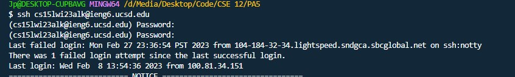

## Lab Report #4

For this lab report, we'll be recreating the steps that were done in our previous week 7 lab.

# Step 1 - ieng6 Login

For the first step we'll be logging into ieng6 through a VSCode terminal. 

You'll need your ieng6 account to proceed with this step and throughout the rest of the lab, so make sure you have your username and password at hand.
There is no specific keys to press for this step, however if you had previously logged in or by any chance you had typed ssh before, you can press the arrow key ```<up>``` 
to bring up the previous command typed into the terminal.



# Step 2 - Clone the fork 

The next step in the lab was to clone the respository that was given to us. 

Since I had already done this previously, I pressed ```<up><enter>``` to type the command into the bash terminal.


# Step 3 - Run the Tests

The step after cloning the fork is to run the test and to show that they fail, which is shown below. This was achieved by hitting ```<up><up><up><enter>``` on the command line as I had also previously typed this command.


In the picture above, I also used commands like ```ls``` and ```cd``` to change into the lab 7 directory but I had no history of this so it was typed manually.


