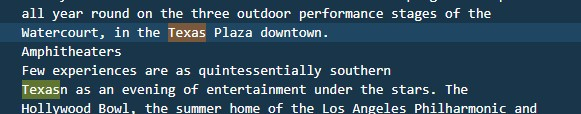
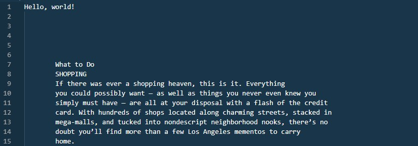
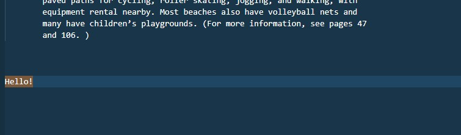
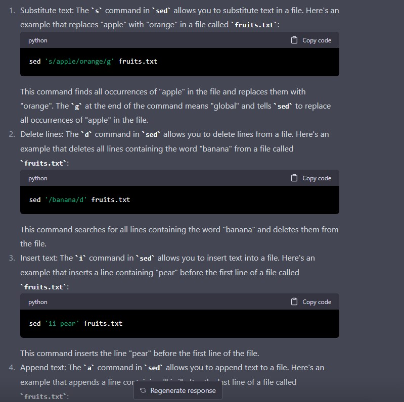

# Lab Report 5
  
  For this lab, we will be focusing on the docsearch lab but instead of using ```grep```, ```find``` or ```less``` we will be using the command ```sed```.
  
  This command can be useful in many cases such as replacing text, deleting lines, or even inserting text.
  
  ## Example 1
  
  For the first example of the ```sed``` command, we'll be using ``` sed 's/California/Texas/g'```. 
  This command uses ```s``` to substitute California and replaces it with Texas.
  
  The command ran below is  ```sed 's/California/Texas/g' input.txt > output.txt```.
  This command replaces every pattern that says California for the word Texas.
  
  
  
  We can see below an example of the instance being replaced.
  
  
  Another example of the same command being ran would be when I ran ```sed 's/more/less/g' written_2/travel_guides/berlitz1/WhatToLosAngeles.txt > output.txt```
  which replaced every pattern that said ```more``` with ```less```
  
  
  
  We can again see the example below
  
  
  
  ## Example 2
  
  The next command we ran for ```sed``` was ```sed '/California/d' ```. This command deletes every instance of California in the given file. 
  
  For example, ```sed '/California/d' written_2/travel_guides/berlitz1/WhatToLosAngeles.txt > output.txt``` deletes every instance of California and stores the new       file into output.txt
  
  
  
  In the top right of the file, we can see that there is no instance of California
  
  
  
  Another example of this same command is done by running For example, ```sed '/more/d' written_2/travel_guides/berlitz1/WhatToLosAngeles.txt > output.txt```
  
  This command just deletes every instance of more in the given file.
  
  
   
   
  
  ## Example 3
  
  The next iteration of sed that I will be using is ```sed '1iHello, world!'```
  This command adds 'Hello, World!' to the first line of a given file.
  
  For example, ```sed '1iHello, world!' written_2/travel_guides/berlitz1/WhatToLosAngeles.txt > output.txt``` 
  
  
  
  After running the command, we can see that "Hello, World!" was inserted to the first line of the file.
  
  
  
  The next command being ran is ```sed '2iGoodbye!' written_2/travel_guides/berlitz1/WhatToLosAngeles.txt > output.txt```
  Which inserts Goodbye into the second line of the file.
  
  
  
  Below we can see the result.
   
  
  
  ## Example 4
  
  The final example of sed is by using ```sed '$a Hello!' ``` 
  which adds `Hello!` to the last line of the given file.
  
  For example, ```sed '$a Hello!' written_2/travel_guides/berlitz1/WhatToLosAngeles.txt > output.txt```
  
  
  
  Can be shown in the picture below
  
  
  
  Another example of this by doing ```sed '$a Goodbye' written_2/travel_guides/berlitz1/WhatToLosAngeles.txt > output.txt```

  
  
  This can also be shown in the example below.
  
  
  
  # Sources
  
  All sources for these commands were researched using ChatGPT as can be seen below!
  
  
